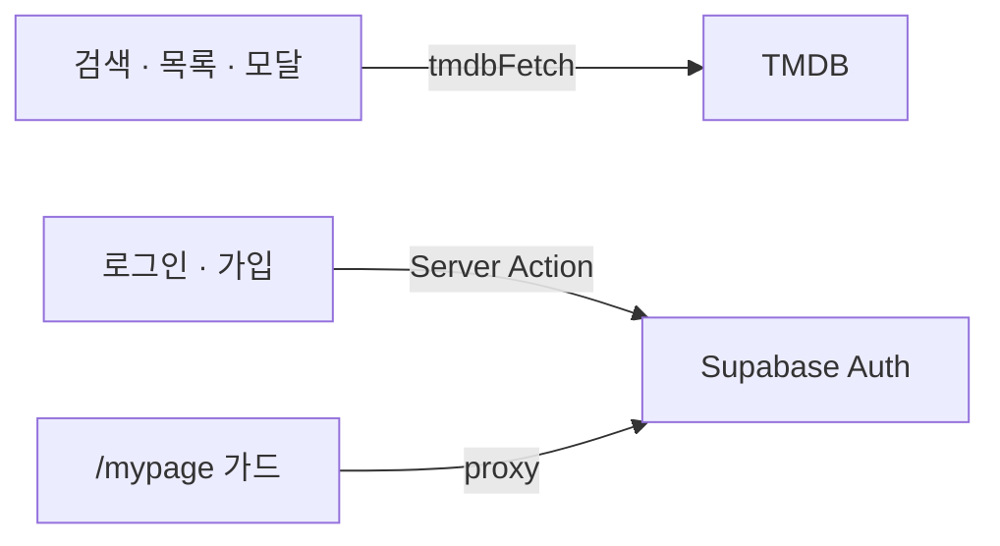

# Xflix

[](https://xflix-next-ten.vercel.app/) [](https://swjeon-dev.github.io/Xflix--sw/) [](https://www.figma.com/make/6gAd7XAT3ErQOj8xVDt8Cq/Movie-Detail-Page-Design?p=f&t=zVHKCNqmHkqM0ES3-0)

TMDB API 기반 영화·TV 탐색 서비스입니다.  
Vite SPA를 **Next.js App Router**로 옮기며, 검색·무한 스크롤·모달 같은 흐름을 라이브러리에 크게 기대지 않고 직접 맞춘 프로젝트입니다.

## 화면


## Work

- **조회** — TMDB 요청을 `shared/api`에 모으고, 목록·상세·검색은 커스텀 훅에서 `loading` / `error` / `data`를 직접 다룹니다.
- **Next 경계** — 탐색·검색·모달은 클라이언트. 이메일 로그인·가입·비밀번호 변경은 Server Action입니다.
- **proxy** — Next 16에서 `middleware.ts` / `middleware()`가 `proxy.ts` / `proxy()`로 바뀌었습니다. Next가 파일 이름으로 찾아 요청 전에 실행하므로, 루트에 `middleware.ts`가 없어도 `src/proxy.ts`면 됩니다. `matcher: ['/mypage']`일 때만 돌고, Supabase 세션을 갱신한 뒤 비로그인이면 `/login-required`로 보냅니다.
- **무한 스크롤** — `IntersectionObserver`로 홈 캐러셀(가로)과 목록·검색(세로)을 공통 훅으로 처리합니다.
- **검색** — 헤더 모달 → `/search?query=` 로 상태를 URL에 두고, 영화 / TV 탭을 나눕니다.
- **모달** — Portal, body scroll lock, ESC 종료를 검색·예고편·모바일 메뉴에 같이 적용합니다.

## 설계도

한 요청의 순서가 아니라 **역할**입니다. `proxy`는 `/mypage`만 탑니다.



- 콘텐츠: TMDB. 클라이언트 `tmdbFetch`.
- 인증: Supabase. Server Action + `/mypage` proxy.

## 코드 구조

FSD를 규모에 맞게 쓰고, Next `src/app`은 라우트·layout만 담당합니다.

```text
src/
  proxy.ts          /mypage 가드 · 세션 갱신 (Next 16 proxy)
  app/              Next 라우트 · layout · metadata
  application/      Providers, 세션
  widgets/          header, home, carousel, genre, movie-detail, tv-detail
  features/         search, trailer, episodes, auth
  entities/         movie, tv, media, person
  shared/           api, ui, config
```

```text
src/app → widgets → features → entities → shared
```

## 기능

- 홈 영화 / TV 섹션, 장르 목록·필터
- 영화 / TV 상세, 예고편·에피소드 모달
- 검색 모달·결과 무한 스크롤
- 로그인·마이페이지

## 스택

Next.js (App Router) · TypeScript · Tailwind CSS · TMDB API · Supabase (Auth)

## 면접에서 나올 질문

**Next 16 `proxy`와 예전 middleware의 차이는?**  
파일 이름과 export가 `proxy.ts` / `proxy()`로 바뀌었습니다. Next가 요청 전에 찾아 실행합니다. 이 프로젝트는 `matcher: ['/mypage']`만 돌리고, Supabase 세션을 갱신한 뒤 비로그인이면 `/login-required`로 보냅니다.

**왜 검색은 클라이언트, 로그인은 Server Action인가?**  
검색은 URL·탭·무한스크롤 이벤트가 핵심입니다. 로그인은 비밀번호와 세션 쿠키를 서버에서 닫습니다.

**FSD를 왜 쓰나? 과하지 않나?**  
`components/`만 있으면 검색 UI와 홈 UI가 같은 깊이에 섞입니다. widget / feature / entity / shared만 쓰고, Next `app/`은 라우트만 담당합니다.

**TMDB 키를 `NEXT_PUBLIC_`에 둔 이유는?**  
클라이언트 목록 요청에 씁니다. 읽기 토큰이 브라우저에 노출되는 한계가 있습니다. 서버 프록시로 옮기는 편이 낫습니다.
